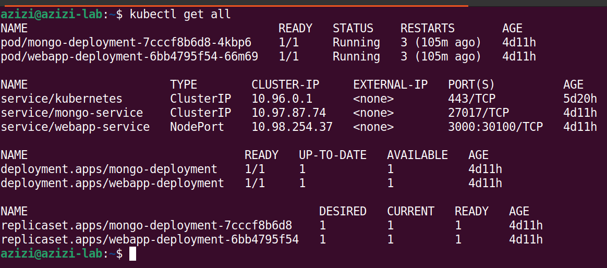
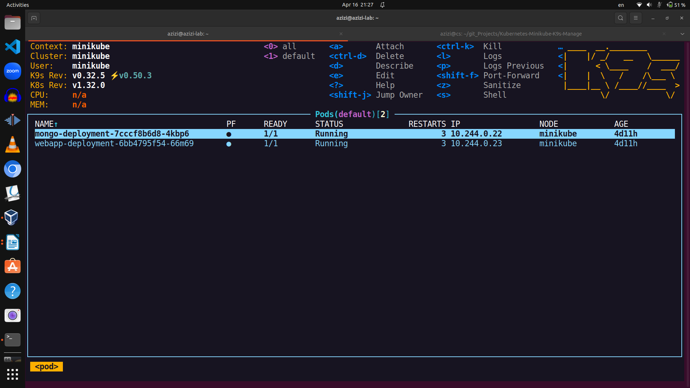

# Kubernetes: Minikube and k9s
In this project, we will install and run Kubernetes using Minikube. 

* Minikube
https://minikube.sigs.k8s.io/docs/
* K9S:
https://k9scli.io/

## Step1: Install Minikube
Install Minikube to run the kubernetes cluster and Pods on it:
```
curl -LO https://storage.googleapis.com/minikube/releases/latest/minikube-linux-amd64
sudo install minikube-linux-amd64 /usr/local/bin/minikube
```
## Step 2: Start Minikube
### minikube start

* **Note**:
Minikube can use Docker as a driver to run on it. So, if you get any error regarding the drive, do as follow:
Install Docker:
```
sudo apt install docker.io
```
Set the Driver and start Minikube:
```
minikube start --driver=docker
```
* **Out put:**
```
azizi@azizi-lab:~$ minikube start --driver=docker
😄  minikube v1.35.0 on Ubuntu 22.04 (vbox/amd64)
✨  Using the docker driver based on existing profile
👍  Starting "minikube" primary control-plane node in "minikube" cluster
🚜  Pulling base image v0.0.46 ...
🔄  Restarting existing docker container for "minikube" ...
🐳  Preparing Kubernetes v1.32.0 on Docker 27.4.1 ...
🔎  Verifying Kubernetes components...
    ▪ Using image gcr.io/k8s-minikube/storage-provisioner:v5
🌟  Enabled addons: storage-provisioner, default-storageclass
🏄  Done! kubectl is now configured to use "minikube" cluster and "default" namespace by default
```
## Step 3: Install Kubectl
```
sudo apt install kubectl
```
## Step 4: Prepare kubernetes files as below
```
k8s-basic/
├── mongo-config.yaml     ← holds MongoDB URL (like "where to connect")
├── mongo-secret.yaml     ← holds MongoDB username and password
├── mongo.yaml            ← runs MongoDB and makes it available inside the cluster
└── webapp.yaml           ← runs the web app and makes it available from outside
```
* mongo-config.yaml [here](mongo-config.yaml)
* mongo.yaml [here](mongo.yaml)
* webapp.yaml [here](webapp.yaml)
* mongo-secret.yaml [here](mongo-secret.yaml)

### Undrestanding how everything works? 
* MongoDB starts up:
  
  - Uses the secret (username & password) from mongo-secret.yaml
  
  - Gets exposed inside the cluster via mongo-service

* Web App starts up:
  
  - Reads the MongoDB username and password from the same secret
  
  - Reads the MongoDB address from the config map
  
  - Connects to MongoDB using those values
  
* Web App Service (NodePort):
  
  - Exposes the web app on your browser at localhost:30100

### Check if Minikube cluster is running
```
azizi@azizi-lab:~$ kubectl cluster-info
Kubernetes control plane is running at https://192.168.49.2:8443
```
### Apply Kubernetes Configurations
```
 kubectl apply -f mongo.yaml
 kubectl apply -f mongo-config.yaml
 kubectl apply -f mongo-secret.yaml
 kubectl apply -f webapp.yaml
```
### Check if everything runs correctly:
```
azizi@azizi-lab:~$ kubectl get all
NAME                                     READY   STATUS    RESTARTS      AGE
pod/mongo-deployment-7cccf8b6d8-4kbp6    1/1     Running   3 (72m ago)   4d10h
pod/webapp-deployment-6bb4795f54-66m69   1/1     Running   3 (72m ago)   4d10h

NAME                     TYPE        CLUSTER-IP     EXTERNAL-IP   PORT(S)          AGE
service/kubernetes       ClusterIP   10.96.0.1      <none>        443/TCP          5d20h
service/mongo-service    ClusterIP   10.97.87.74    <none>        27017/TCP        4d10h
service/webapp-service   NodePort    10.98.254.37   <none>        3000:30100/TCP   4d10h

NAME                                READY   UP-TO-DATE   AVAILABLE   AGE
deployment.apps/mongo-deployment    1/1     1            1           4d10h
deployment.apps/webapp-deployment   1/1     1            1           4d10h

NAME                                           DESIRED   CURRENT   READY   AGE
replicaset.apps/mongo-deployment-7cccf8b6d8    1         1         1       4d10h
replicaset.apps/webapp-deployment-6bb4795f54   1         1         1       4d10h
azizi@azizi-lab:~$ 
azizi@azizi-lab:~$ minikube service webapp-service
|-----------|----------------|-------------|---------------------------|
| NAMESPACE |      NAME      | TARGET PORT |            URL            |
|-----------|----------------|-------------|---------------------------|
| default   | webapp-service |        3000 | http://192.168.49.2:30100 |
|-----------|----------------|-------------|---------------------------|
🎉  Opening service default/webapp-service in default browser...
```


### Access the web app on:
```
 http://192.168.49.2:30100
```
## Step 5: K9S
[K9s](https://k9scli.io/) is a terminal based UI to interact with your Kubernetes clusters. 

### Install k9s
```
azizi@azizi-lab:~$  wget https://github.com/derailed/k9s/releases/download/v0.32.5/k9s_linux_amd64.deb
```
```
azizi@azizi-lab:~$  sudo apt install ./k9s_linux_amd64.deb
```
```
azizi@azizi-lab:~$  rm k9s_linux_amd64.deb
```
### Run ks9
```
azizi@azizi-lab:~$  k9s
```


There are many options and contrl keys that we can monitor, configure and re-run our cluster pods. 
